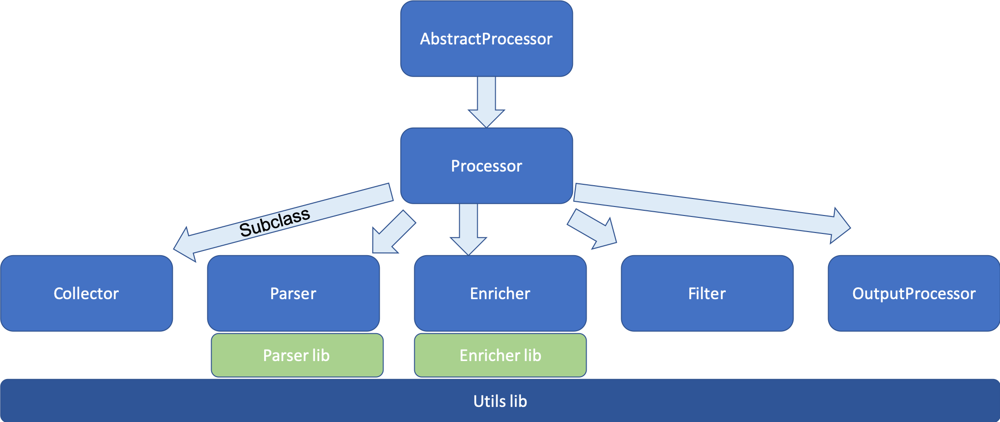

# Object Oriented Architecture

``Processor`` inherits from ``AbstractProcessor``

All others (``Collector``, ``Parser``, ``Enricher``, ``Filter``, ``OutputProcessor``) inherit from ``Processor``.

# What are the roles of each processor?

* Collectors are used for *fetching* data from somewhere. They *do not* parse the data into the internal data format.
* Parsers will take the output of a collector and parse it, validate it and convert it to the internal data format.
* Enrichers may be recarded similarly to lambda functions: the are side-effect free. They will take a message passed to them, take some part of that message, do some lookup in possible external data bases or data sets, or calculate some value based on the incoming message. Then, upon successful enrichment processing, it will add a new data element (usually a key-value pair) to the message.
* Filters: these take an incoming message, look at some data there and based on some (usually configurable) filter conditions. If an incoming message matches the filter expression, this message will *NOT* be forwarded (but logged that it was filtered out). A filter MAY use some external data set (such as "has this already been seen?") to do its job.
* OutputProcessor: this type of processor shall send a message to some output. Typical outputs could be: a database, Splunk, Elastic Search, MISP, etc. Note well that triggering an action (such as adding an IP address to a blocklist) is also part of an OutputProcessors' job. It is just another type of output sort of.

# How are the processors connected to each other? How do I create a workflow?

Please see the [Config section on the workflow.yml](Config.md) chapter for examples on how to specify workflows in the config.  

